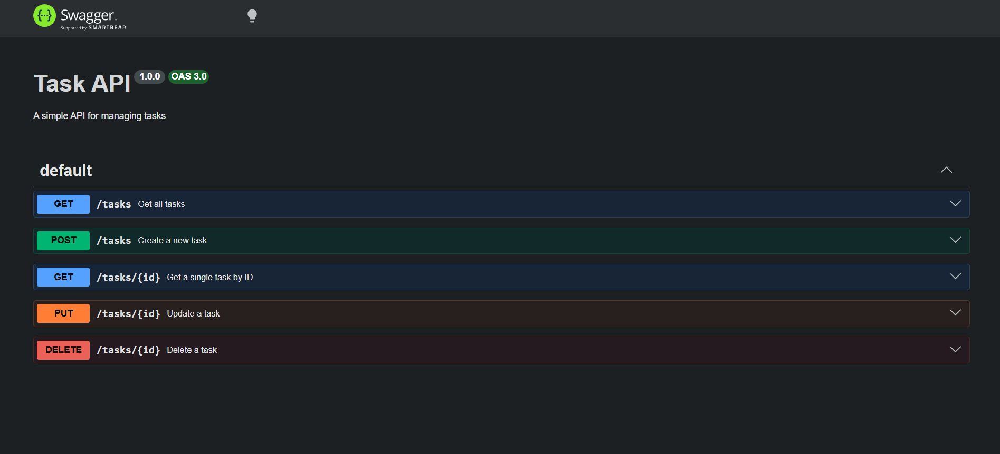

# Task API

A small CRUD API for managing a to-do list, built with Node.js and Express. Tasks are stored in memory (no database) and support full CRUD — create, read, update, and delete. Interactive API documentation is served via Swagger UI.

## Installation & Running

```bash
npm install 
node app.js
```

The server will start on `http://localhost:3000`.

## Endpoints

| Method | Path          | Description                          |
|--------|---------------|---------------------------------------|
| GET    | `/`           | API info (name, version, endpoints)  |
| GET    | `/health`     | Health check — confirms server is up |
| GET    | `/tasks`      | Get all tasks                        |
| POST   | `/tasks`      | Create a new task                    |
| GET    | `/tasks/:id`  | Get a single task by ID              |
| PUT    | `/tasks/:id`  | Update a task's title and/or status  |
| DELETE | `/tasks/:id`  | Delete a task                        |

## API Docs

Interactive documentation (Swagger UI) is available at:

```
http://localhost:3000/docs
```



## Example Request

```
$ curl -i -X POST http://localhost:3000/tasks -H "Content-Type: application/json" -d "{\"title\":\"Buy milk\"}"

HTTP/1.1 201 Created
X-Powered-By: Express
Content-Type: application/json; charset=utf-8
Content-Length: 40
ETag: W/"28-PpSBYV7i68cXyGc7AhjVpkZkY5Q"
Date: Sun, 19 Jul 2026 16:17:07 GMT
Connection: keep-alive
Keep-Alive: timeout=5

{"id":4,"title":"Buy milk","done":false}
```
