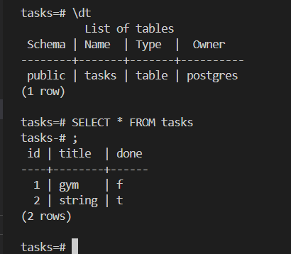

# Task API

A small CRUD API for managing a to-do list, built with Node.js, Express, and PostgreSQL. Tasks are stored in a Postgres database and support full CRUD — create, read, update, and delete. Interactive API documentation is served via Swagger UI.

## Running the project

Everything (the API and the database) runs with a single command using Docker Compose.

**1. Clone the repo**
```bash
git clone https://github.com/skiller99668/todo-list.git
cd todo-list
```

**2. Set up environment variables**

Copy `.env.example` to `.env` and fill in your own values:
(your own database password, url and database name)
```bash
cp .env.example .env
```

See `.env.example` for the required variables (database credentials and connection string).

**3. Start everything**
```bash
docker compose up
```

This builds the API image, starts the Postgres database, and connects them together. The API will be available at `http://localhost:3000`.

**4. Stop everything**
```bash
docker compose down
```
This will stop and remove the containers. Your created/modified tasks will remain unchanged in the database and all will be restored the next time _docker compose up_ is ran.

## Endpoints

| Method | Path          | Description                          |
|--------|---------------|---------------------------------------|
| GET    | `/`           | API info (name, version, endpoints)  |
| GET    | `/health`     | Health check — confirms server is up |
| GET    | `/tasks`      | Get all tasks                        |
| POST   | `/tasks`      | Create a new task                    |
| GET    | `/tasks/:id`  | Get a single task by ID              |
| PUT    | `/tasks/:id`  | Update a task's title and/or status  |
| DELETE | `/tasks/:id`  | Delete a task                        |

## API Docs

Interactive documentation (Swagger UI) is available at:

http://localhost:3000/docs


## Example Request

$ curl -i -X POST http://localhost:3000/tasks -H "Content-Type: application/json" -d "{"title":"Buy milk"}"
HTTP/1.1 201 Created
X-Powered-By: Express
Content-Type: application/json; charset=utf-8
Content-Length: 40
ETag: W/"28-PpSBYV7i68cXyGc7AhjVpkZkY5Q"
Date: Sun, 19 Jul 2026 16:17:07 GMT
Connection: keep-alive
Keep-Alive: timeout=5
{"id":4,"title":"Buy milk","done":false}


## Database

Data is persisted in PostgreSQL. To view it directly:
 
```bash
docker compose exec db psql -U postgres -d tasks
```
 
```sql
\dt
SELECT * FROM tasks;
```
 
