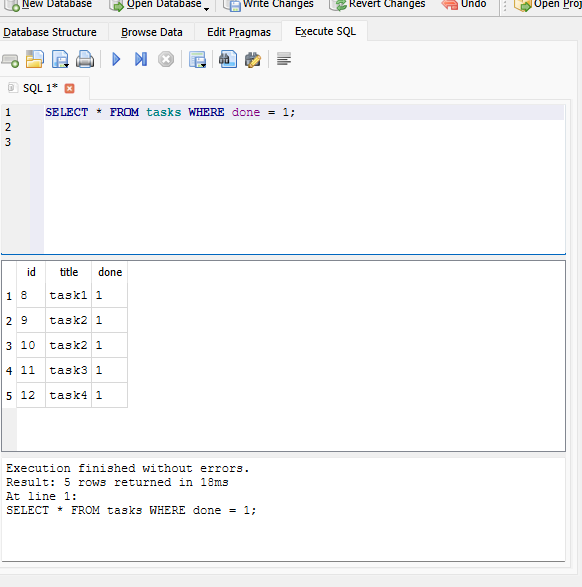

# Task API

A small CRUD API for managing a to-do list, built with Node.js and Express. Tasks are stored in a SQLite database and support full CRUD — create, read, update, and delete. Interactive API documentation is served via Swagger UI.

## Why SQLite

SQLite was chosen because it's a single file with zero setup — no server to install, no password, no Docker container. The whole database is just `tasks.db`, created automatically the first time the app runs. Data survives a server restart, which was the whole point of moving off in-memory storage.

## Where the database lives

The database file is `tasks.db`, created automatically in the project root the first time you run the app. It's git-ignored, so a fresh clone always starts with a clean database — the app creates the file, the `tasks` table, and seeds three example tasks on first run only.

## Installation & Running

Run the following commands in your terminal of choice (e.g. Terminal on Mac, Command Prompt or PowerShell on Windows).

**1. Clone the repo**
```bash
git clone https://github.com/skiller99668/todo-list.git
```

**2. Move into the project folder**
```bash
cd todo-list
```

**3. Install dependencies**
```bash
npm install
```

**4. Start the server**
```bash
node app.js
```

That's the one command — it starts the server, creates `tasks.db` if it's missing, creates the `tasks` table if it's missing, and seeds three example tasks if the table is empty. The server runs on `http://localhost:3000`.

## Endpoints

| Method | Path          | Description                          |
|--------|---------------|---------------------------------------|
| GET    | `/`           | API info (name, version, endpoints)  |
| GET    | `/health`     | Health check — confirms server is up |
| GET    | `/tasks`      | Get all tasks                        |
| POST   | `/tasks`      | Create a new task                    |
| GET    | `/tasks/:id`  | Get a single task by ID              |
| PUT    | `/tasks/:id`  | Update a task's title and/or status  |
| DELETE | `/tasks/:id`  | Delete a task                        |

## API Docs

Interactive documentation (Swagger UI) is available at:

```
http://localhost:3000/docs
```


## Example Request

```
$ curl -i -X POST http://localhost:3000/tasks -H "Content-Type: application/json" -d "{\"title\":\"Buy milk\"}"

HTTP/1.1 201 Created
X-Powered-By: Express
Content-Type: application/json; charset=utf-8
Content-Length: 40
ETag: W/"28-PpSBYV7i68cXyGc7AhjVpkZkY5Q"
Date: Sun, 19 Jul 2026 16:17:07 GMT
Connection: keep-alive
Keep-Alive: timeout=5

{"id":4,"title":"Buy milk","done":false}
```

## Database

Data is persisted in SQLite (`tasks.db`). You can browse it directly using [DB Browser for SQLite](https://sqlitebrowser.org/) — open `tasks.db`, and you'll see the `tasks` table and its rows laid out like a spreadsheet.



**Example SQL query run in DB Browser (Stage 4):**

```sql
SELECT * FROM tasks WHERE done = 1;
```

This returned only the completed tasks — a nice example of how filtering can be pushed down to SQL instead of looping over data in the app.