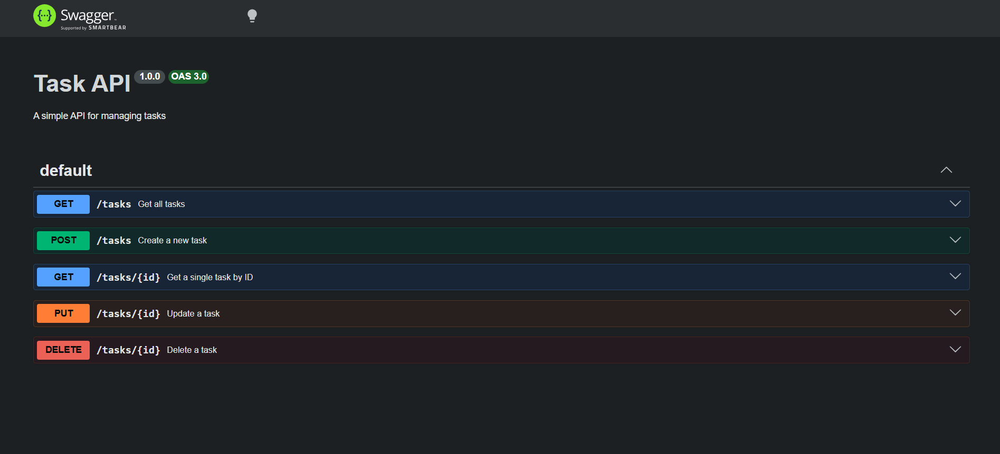
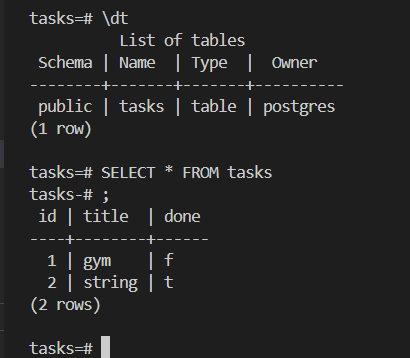

# Task API

A small CRUD API for managing a to-do list, built with Node.js, Express, and PostgreSQL, with user authentication powered by Supabase Auth. Tasks are stored in a Postgres database and support full CRUD — create, read, update, and delete. Selected routes are protected behind a JWT bearer token issued by Supabase. Interactive API documentation is served via Swagger UI, including an "Authorize" flow for testing protected routes from the browser.

## Running the project

Everything (the API and the database) runs with a single command using Docker Compose.

**1. Clone the repo**
```bash
git clone https://github.com/skiller99668/todo-list.git
cd todo-list
```

**2. Set up environment variables**

Copy `.env.example` to `.env` and fill in your own values:

```bash
cp .env.example .env
```

You'll need:
- Your own database password, URL, and database name (Postgres)
- A free [Supabase](https://supabase.com) project's **Project URL** and **anon key** (found under Project Settings → API — never use the `service_role` key here)

See `.env.example` for the required variable names.

> **Note:** in your Supabase project, go to Authentication → Sign In / Providers → Email and turn **off** "Confirm email" so freshly signed-up test users can log in immediately without verifying an inbox.

**3. Start everything**
```bash
docker compose up
```

This builds the API image, starts the Postgres database, and connects them together. The API will be available at `http://localhost:3000`.

**4. Stop everything**
```bash
docker compose down
```
This will stop and remove the containers. Your created/modified tasks will remain unchanged in the database and will be restored the next time `docker compose up` is run.

## Endpoints

| Method | Path                  | Description                             | Auth required? |
|--------|-----------------------|------------------------------------------|-----------------|
| GET    | `/`                   | API info (name, version, endpoints)     | No |
| GET    | `/health`             | Health check — confirms server is up    | No |
| GET    | `/public/info`        | Public, open info endpoint              | No |
| POST   | `/auth/signup`        | Create a new user account               | No |
| POST   | `/auth/login`         | Log in, returns access & refresh tokens | No |
| POST   | `/auth/logout`        | End the current session                 | **Yes** (Bearer) |
| GET    | `/protected/profile`  | Get the logged-in user's profile        | **Yes** (Bearer) |
| GET    | `/protected/dashboard`| Sample second protected route           | **Yes** (Bearer) |
| GET    | `/tasks`              | Get all tasks                           | No |
| POST   | `/tasks`              | Create a new task                       | No |
| GET    | `/tasks/:id`          | Get a single task by ID                 | No |
| PUT    | `/tasks/:id`          | Update a task's title and/or status     | No |
| DELETE | `/tasks/:id`          | Delete a task                           | No |

Protected routes expect a header of the form:
```
Authorization: Bearer <access_token>
```
where `<access_token>` is the token returned from `POST /auth/login`.

## API Docs

Interactive documentation (Swagger UI) is available at:

http://localhost:3000/docs

Protected routes show a lock icon. Click **Authorize** at the top right (lock icon), paste in an access token from `/auth/login`, and you can then use **Try it out** on any protected route directly from the browser.



## Example Requests

**Sign up and log in:**
```
$ curl -i -X POST http://localhost:3000/auth/signup \
  -H "Content-Type: application/json" \
  -d '{"email":"test@gmail.com","password":"password123"}'
HTTP/1.1 201 Created
{"message":"Created","user":{"id":"...","email":"test@gmail.com", ...}}

$ curl -i -X POST http://localhost:3000/auth/login \
  -H "Content-Type: application/json" \
  -d '{"email":"skyler.test@gmail.com","password":"password123"}'
HTTP/1.1 200 OK
{"access_token":"eyJhbGciOi...","refresh_token":"..."}
```

**Calling a protected route:**
```
$ curl -i http://localhost:3000/protected/profile \
  -H "Authorization: Bearer eyJhbGciOi..."
HTTP/1.1 200 OK
{"id":"...","email":"test@gmail.com","created_at":"..."}
```

**Creating a task:**
```
$ curl -i -X POST http://localhost:3000/tasks \
  -H "Content-Type: application/json" \
  -d '{"title":"Buy milk"}'
HTTP/1.1 201 Created
{"id":4,"title":"Buy milk","done":false}
```

## Database

Data is persisted in PostgreSQL. To view it directly:

```bash
docker compose exec db psql -U postgres -d tasks
```

```sql
\dt
SELECT * FROM tasks;
```

